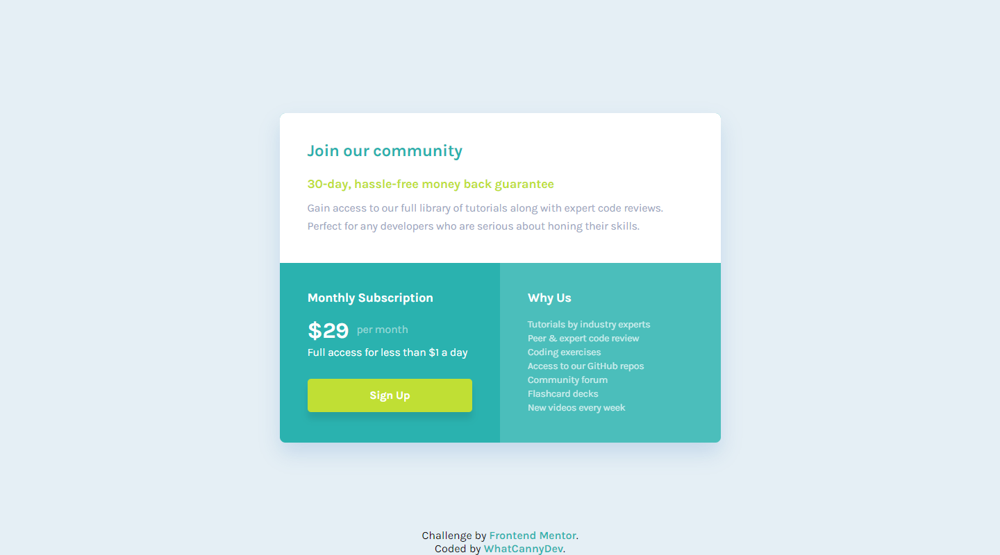

# Frontend Mentor - Single price grid component solution

This is a solution to the [Single price grid component challenge on Frontend Mentor](https://www.frontendmentor.io/challenges/single-price-grid-component-5ce41129d0ff452fec5abbbc). Frontend Mentor challenges help you improve your coding skills by building realistic projects. 

## Table of contents

- [Overview](#overview)
  - [The challenge](#the-challenge)
  - [Screenshot](#screenshot)
  - [Links](#links)
- [My process](#my-process)
  - [Built with](#built-with)
- [Author](#author)

## Overview

### The challenge

Your challenge is to build out this pricing component and get it looking as close to the design as possible.

You can use any tools you like to help you complete the challenge. So if you've got something you'd like to practice, feel free to give it a go.

Users should be able to:

- View the optimal layout for the component depending on their device's screen size
- See a hover state on desktop for the Sign Up call-to-action

### Screenshot

### Links

- Solution Repository URL: [Click here](https://github.com/CannyRo/FrontendMentor_SinglePriceGridComponent_5ce41129d0ff452fec5abbbc)
- Live Site URL: [Click here](https://cannyro.github.io/FrontendMentor_SinglePriceGridComponent_5ce41129d0ff452fec5abbbc/)

## My process

### Built with

- Semantic HTML5 markup
- CSS custom properties
- Flexbox
- CSS Grid
- Mobile-first workflow

## Author

- Website - [WhatCannyDev is searching a work-study contract in France](https://cannyro.github.io/hire_mr_canny/en)
- Frontend Mentor - [@CannyRo](https://www.frontendmentor.io/profile/CannyRo)
- GitHub - [@CannyRo](https://github.com/CannyRo)
- LinkedIn - [Ronan CANNY](https://www.linkedin.com/in/ronan-canny-b29443277/)
